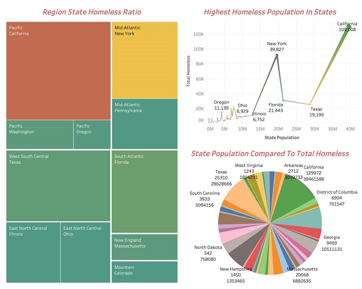
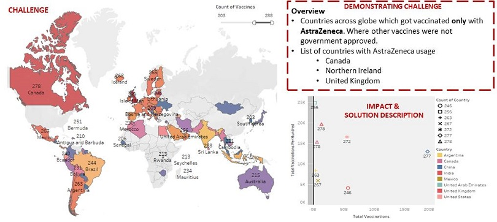
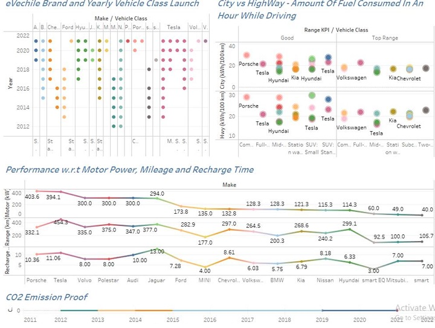
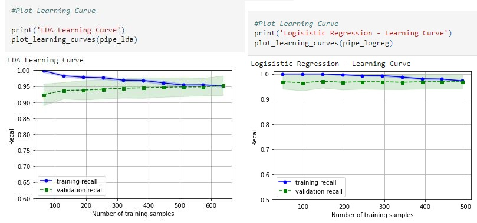
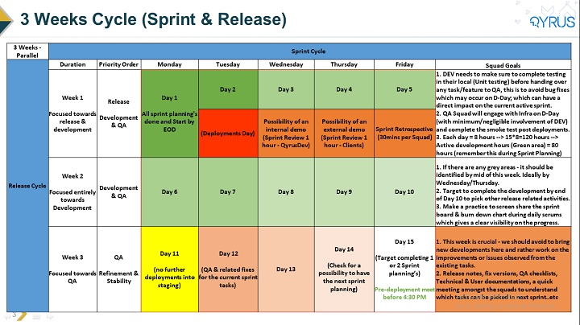

| Bipin Chandra Rayilla - Toronto, ON, Canada |[LinkedIn Profile](https://www.linkedin.com/in/bipinchandrarayilla/) - [Articles](https://medium.com/@bipinchandra_rayilla) - [GitHub](https://github.com/BipinChandra-Rayilla)

---

## About Me
Focused towards leading projects with multiple teams, services, processes and tools, which are on strict timelines that adhere to brand values. I believe in having a desire to learn from each step and opportunity which can help me acquire knowledge to the real world experiences and leadership. I see a purpose and value in serving, coaching, mentoring and leading teams.
- B2B EDI Integration, Middleware and Project Management are my professional areas with 7.8 years of IT experience. 
- Competent in EDI, SAP Sales & Distribution - Intermediate level, an Agile Practitioner, and a Scrum Master & Project Manager - Qyrus (SaaS & AI platform).
- I have been pursuing Business Administartion & Data Analytics post graduation degrees and based on my earlier experience. I will be levelling up my career towards the title of this page in the upcoming days.
- Besides professional summary - I am violinst, vocalist, strength & conditioing enthusiast, and idiolize Batman. I love capturing startrails, photography, writing and motorcycle travelling (2500 kms is the longest stretch I have covered so far)

---

## Career Timeline
- Agile Project Manager (2021)
- PMO & Scrum Master (2019)
- Senior EDI Consultant (2018)
- B2B Application Developer & Module Lead (2016)
- B2B EDI Developer (2015)
- EDI Analyst (2014)
- Software Trainee (2013)

---

## Stakeholders & Interactions

 - Domain experties across Healthcare, Retail, Automobile & Manufacturing, Telecommunication, Banking, SaaS Product Development & B2B Technologies.

BASF | Coles | Ford Motor Company | 2000+ Suppliers across Ford | Motorola Mobility | Lenovo | Mashreq | Waste Management | Shawbrook | Ingram Micro

---

## [Business Administration - York University](https://continue.yorku.ca/programs/post-graduate-certificate-in-business-administration/)
It has always been a dream to study in an international university and get a degree. The learning outcomes, key insights, connections made, blogs written, and projects worked have been a huge value add to me. Have a glimpse of it - [here](https://github.com/BipinChandra-Rayilla/business-administration/blob/main/README.md)

## [Data Analytics (business decision making) - Durham College](https://durhamcollege.ca/programs/data-analytics-for-business-decision-making-graduate-certificate)
Besides Project Management Domain; Data & Business Analysis were my passionate areas and that is the main reason for working towards them through this program. In the last 6 months I have gained insights towards various topics, different knowledge areas, diverse interactions, debates, articles, and many more. Here is a [glance](https://github.com/BipinChandra-Rayilla/Data-Analytics/blob/main/README.md)  

---

## Skills
1. Data Analytics, Digital Data Analytics.
2. Python, Tableau, Power BI, Jupyter (Pandas, Numpy, Matplotlib, Seaborn, Scrapy and BeautifulSoup)
3. Agile Methodologies, Project Management, Business Strategy
4. Increased Cross-Functional Teams Productivity, People Leader

---
# Projects Created, Contributed & Value Add
## Data Analysis & Visualizations
### 1. Descriptive Analysis and Statistic - [source code](https://github.com/BipinChandra-Rayilla/Descriptive-Analysis-Statistics)
### The health care and government departments can look into the below data and consider the importance to provide necessities by prioritising based on volume.

## 2. COVID-19 Vaccination Progress
### This visualization focuses on AstraZeneca and further details on how major countries can improvies. [dataset](https://github.com/BipinChandra-Rayilla/Data-Visualization-Covid-19-/edit/main/README.md)

## 3. Battery Electric Vehicles Rating (2012-2021) - [source code](https://github.com/BipinChandra-Rayilla/Battery-Electric-Vehicles-Rating)
### Analysis 
### This will help business to analyse on the performance of vehciles and also forecast how electric vehicles can be revolutionary in future.
- All the vehicles listed here are electric/battery based. (2012-2021)
- These chart determines the make, model and yearly surge of launching the vehicles.
- Each vehicle has a different performance when it drove in a city and when it is on a highway
- - This dataset indicates all the vehicles are emitting 0% carbon dioxide, since each vehicle model fuel by electric/battery
- Running a performance check based on number of kms – if the vehicle is ranging between 0-250 kms then its indicated as Good and the ones above 250-500 are Top Range

## 4. Cancer Data (Python) - [source code](https://github.com/BipinChandra-Rayilla/CancerData-Modelling)
### Identifications Reported: Both LR and LDA reports were matching.
### Logical Regression
- Based on the dataset it is clear that it’s a binomial classification where the response variable is dichotomous (1 or 0).
- The recall range is above 90% range which indicates a good learning curve.
- Class split is clearly identifying the imbalance, which is also observed in support values for each category.
- AUC (Area Under Curve) is 0.98 ~ (approx. 1)
- The trade-off between sensitivity i.e., True Positive Rate and False Positivity Rate is quite perfect.

### Discriminant Analysis
- As per EDA using Pandas Profile Report it was clear that the class was imbalanced and before modeling LDA balancing the data sample was required using SMOTE.
- AUC (Area Under Curve) is 0.97 ~ (approx. 1)
- The trade-off between sensitivity i.e., True Positive Rate and False Positivity Rate is quite perfect.

## 5. Demonstrating an eCommerce Project
### Work Break Down Structure & Business Process Model
- [Swimlanes](https://github.com/BipinChandra-Rayilla/BipinChandraRayilla-Portfolio.github.io/blob/441ca99361eca4fdc669fd8fa681724531fac977/DATA_2203_Assignment%231_%20Assessing%20Strategic%20Value_Rayilla_100851648.pdf)
- [Mindmaps](https://mm.tt/1979863919?t=S7tq4RzW9n)

## 6. Sprint Cycle & Release Trains
### Designed 3 weeks sprint cycle and release train which perfectly works for the Qyrus team. (part of the previous project)

---

## Roles & Responsiblities Performed - Professional Career
[Click here](https://github.com/BipinChandra-Rayilla/Professional-Projects)

---
### Awards & Certifications

1.  “Pat on Back” & “Best Team” Awards from FORD Motor Company and Tech Mahindra
2.  [Certified Scrum Master](https://bcert.me/bc/html/show-badge.html?b=fwnjxinz) from ScrumAlliance
3.  [Verified International Academic Qualifications](https://www.credly.com/badges/9c3e4ce6-8026-45a8-ad21-9229affc5f1f?source=linked_in_profile) from World Education Services
4.  State award for designing a low cost Telescope & Planetarium, Andhra Pradesh, India
5.  Excellence in carnatic violin and vocal performances.

# 5W1H - For the the Organizations
### Articles & Publications (these will help answer the information gathering or problem solving areas)

1. [Analyzing the future of an IT project manager in data analytics](https://medium.com/@bcrayillaofficial/analyzing-the-future-of-an-it-project-manager-in-data-analytics-cba7ec92da34)
2. [Analytics in e-Commerce (a.k.a. e-Commerce Analytics)](https://medium.com/@bipinchandra_rayilla/analytics-in-e-commerce-a-k-a-e-commerce-analytics-ae28634f7b54)
3. [Concepts and relationships among Data Analytics, Data Science, Artificial Intelligence, Machine Learning & Deep Learning](https://medium.com/@bipinchandra_rayilla/concepts-and-relationships-among-data-analytics-data-science-artificial-intelligence-machine-d607f55ff591)
4. [Generic tools used in data analytics](https://medium.com/@bipinchandra_rayilla/generic-tools-used-in-data-analytics-ff47cfd74d78)
5. [Python’s role in data analytics](https://medium.com/@bipinchandra_rayilla/pythons-role-in-data-analytics-7907b417c687)
6. [Transformation and future of data analytics](https://medium.com/@bipinchandra_rayilla/transformation-and-future-of-data-analytics-96ac03164f2e)

---

## Professional Contributions - 

### [Tech Mahindra, Hyderabad, India](https://www.techmahindra.com/en-in/?f=3288545283) - Software Engineer
1.	EDI Consultant (BASF - The Chemical Company)
2.	B2B EDI Developer (Coles)
3.	B2B Application Developer, PMO & Module Lead (Ford Motor Company)

### [Quinnox Consultancy Services, Bangalore, India](https://www.quinnox.com/) - Senior Consultant
1.	B2B Integration Consultant (Motorola Mobility)
2.	PMO & ABM Specialist (On site & Offshore)
3.	Agile PMO, Scrum Master for [Qyrus](https://www.qyrus.com/) (SaaS & AI platform)

### Education

- Bachelors Of Engineering & Technology - Kakatiya University, Warangal, India (2013)
- Business Administration - York University, Toronto, Canada (2021)
- Data Analytics (Business Decision Making) - Durham College, Toronto, Canada (2022)
